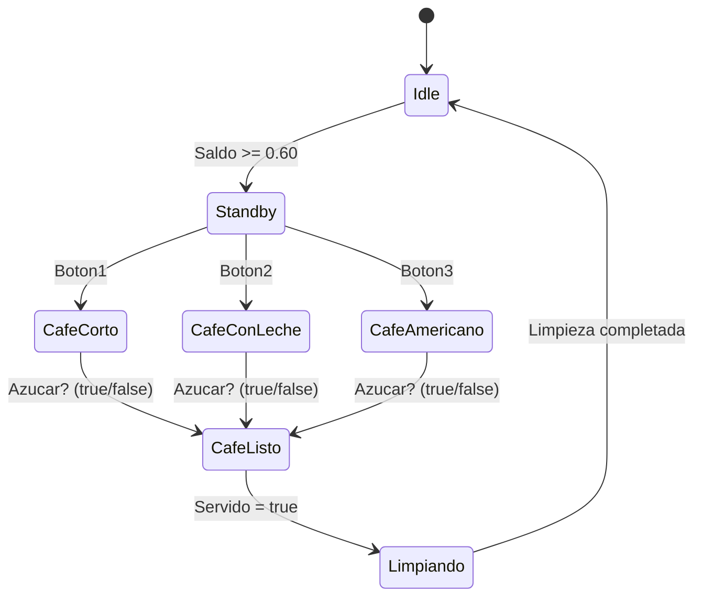

# Máquina de Cafe - Estados

## Descripción del proyecto
Este proyecto simula una máquina de café utilizando un enfoque basado en estados. 
La máquina puede estar en diferentes estados, como "Idle", "Standby", "Café Listo". 
Cada estado tiene su propia lógica y transiciones, lo que permite una 
simulación realista del funcionamiento de una máquina de café. 

### Primer Estado: "Idle"
Este estado representa el estado inicial de la máquina, donde está esperando recibir 
saldo para poder realizar un pedido de café.

### Segundo Estado: "Standby"
Este estado representa el estado en el que la máquina está lista para recibir un pedido de café.

### Tercer , Cuarto y Quinto Estado: "Cafe Corto", "Cafe con Leche", "Cafe Americano"
Estos estados representan los diferentes tipos de café que la máquina puede preparar.

- Si se pulsa el "Boton 1", la máquina pasa al estado "Cafe Corto" y comienza a preparar un café corto.
- Si se pulsa el "Boton 2", la máquina pasa al estado "Cafe con Leche" y comienza a preparar un café con leche.
- Si se pulsa el "Boton 3", la máquina pasa al estado "Cafe Americano" y comienza a preparar un café americano.

Estos tres estados preguntan si el usuario quiere azucar o no, y sea true o false, 
la máquina pasa al siguiente estado "Cafe Listo" y entrega el café al usuario.

### Sexto Estado: "Cafe Listo"
Este estado representa el estado en el que la máquina ha terminado de preparar el café y está listo para ser entregado al usuario. 
En este estado, la máquina muestra un mensaje indicando que el café está listo y espera a que el usuario lo recoja. 

Una vez que el usuario recoge el café, la máquina confirma que Servido = true y pasa al estado "Limpiando", 
donde se limpia la máquina y se prepara para el siguiente pedido.
 
### Septimo Estado: "Limpiando"
Este estado representa el estado en el que la máquina está limpiando después de entregar el café al usuario. 
En este estado, la máquina realiza las tareas de limpieza necesarias para mantener su funcionamiento óptimo. 
Una vez que la limpieza se completa, la máquina vuelve al estado "Idle" y está lista para recibir un nuevo pedido de café.

Antes de volver a "Idle", la maquina calcula el saldo restante, le da el cambio del pedido y el saldo se reinicia a 0.00, 
para que el usuario pueda realizar un nuevo pedido de café.

## Diagrama de estados

